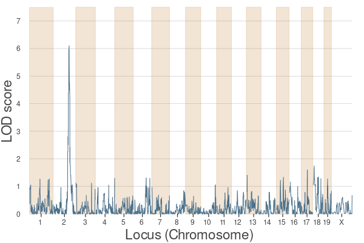
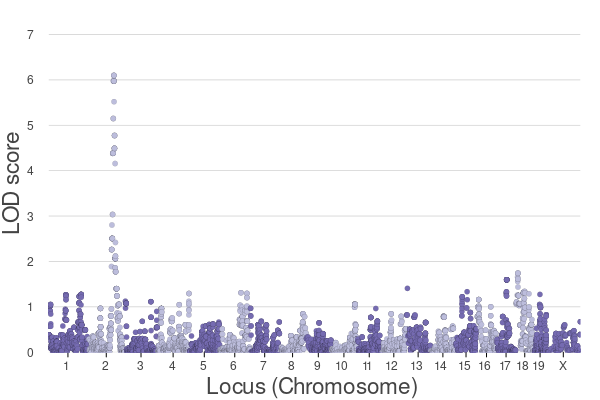

# BigRiverQTL.jl


*A Statistical Toolbox for QTL Analysis*

`BigRiverQTL.jl` is a user-friendly Julia package that supports efficient and interpretable quantitative trait locus (QTL) analysis. This comprehensive toolbox encompasses three core components tailored to streamline the entire QTL analysis workflow: preprocessing, genomic scanning, and result visualization.

- **Preprocessing:** The preprocessing functions are designed to seamlessly import and convert genomic data into an efficient and memory-conservative format. This component also offers function capabilities for quickly calculating kinship matrices, ensuring data readiness for subsequent analysis phases.

- **Genomic Scanning:** `BigRiverQTL.jl` provides advanced genomic scanning capabilities through `BulkLMM.jl` for swift single-trait scans, which surpass other methods in terms of computational speed. For analyses involving multiple traits, the package employs `FlxQTL.jl`, a cutting-edge approach that detects complex trait interrelations.

- **Result Visualization:** The third component of `BigRiverQTL.jl` enriches the analytical experience by offering plotting tools designed to illustrate the outcomes of genomic scans. The plotting functions are useful for interpreting the results and aid in the derivation of meaningful conclusions


## Installation
To install `BigRiverQTL.jl`, you can use Julia's package manager. Here is the command:

```julia
using Pkg
Pkg.add("BigRiverQTL")
```


## Contribution
Contributions to BigRiverQTL.jl are welcome and appreciated. If you'd like to contribute, please fork the repository and make changes as you'd like. If you have any questions or issues, feel free to open an 


# Example QTL
___

This notebook gives an example......

## Data

In this example, we will use a dataset available from the `R/qtl2` package. Specifically, we will use the BXD dataset, which is obtained from the [GeneNetwork](https://genenetwork.org/) website.

You can download the BXD genotype data from the following link:
[Download BXD Genotype Data](https://raw.githubusercontent.com/rqtl/qtl2data/master/BXD/bxd.zip)


### Example - BXD 


```julia
# Libraries
using BigRiverQTL
using Plots
```

#### Data

We assume that the data is stored in `..\data\BXD` directory.


```julia
########
# Data #
########
data_dir = joinpath(@__DIR__, "../data/BXD/");
file = joinpath(data_dir, "bxd.json");
```

Load bxd data using the function `get_geneticstudydata()`: 


```julia
# Load bxd data
data = get_geneticstudydata(file);
```


```julia
# Data types
# makers info 
gInfo = data.gmap;
# pehnotype info 
pInfo = data.phenocov;
# phenotype values 
pheno = data.pheno.val;

# We can get the genotype matrix using the following command:
geno = reduce(hcat, data.geno.val);
# For computing reasons, we need to convert the geno matrix in Float64
geno_processed = convert(Array{Float64}, geno);
```

#### Preprocessing


```julia
#################
# Preprocessing #
#################
traitID = 1112;
pheno_y = pheno[:, traitID];
pheno_y2=ones(length(pheno_y));
idx_nothing = findall(x->x!=nothing,pheno_y)
pheno_y2[idx_nothing]=pheno_y[idx_nothing];
```

#### Kinship


```julia
###########
# Kinship #
###########
kinship = kinship_gs(geno_processed,.99);
```

#### Scan


```julia
########
# Scan #
########

single_results_perms = scan(
	pheno_y2,
	geno_processed,
	kinship;
	permutation_test = true,
	nperms = 1000,
);
```

#### Preprocessing

#### Plots


```julia
#########
# Plots #
#########

# QTL plots
plot_QTL(single_results_perms, gInfo, mbColname = "Pos")

```


```julia
# Manhattan plots
plot_manhattan(single_results_perms, gInfo, mbColname = "Pos")
```

